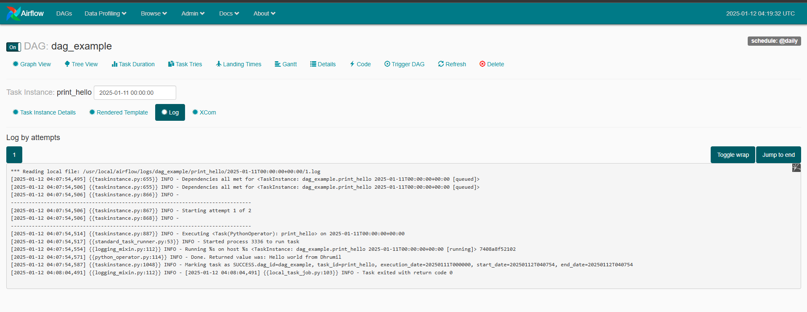

# Apache Airflow 
This repository shows an automation of ETL using Airflow.

## Getting Started
Instructions on how to get a copy of the project up and running on your local machine.

### Prerequisites
List any software, libraries, or hardware needed to run this project.
 Lists : 
 - **List 1** : Need to install Apache Airflow and Docker in local
 - **List 2** : Make sure no image is running in Docker. If it is, stop it and remove it. You can use the following commands to do this: `docker stop $(docker ps -aq)` and `docker rm $( ) ` or `docker image prune`
- **List 3** : In my case, I have Jenkins installed and running on port 8080. If you have Jenkins installed, you can use the following command to stop it: `http://localhost:8080/exit`

### Installing
- **Step 1**: 
Create a new docker container using the following command: `docker-compose up --build`
- **Step 2**:
Go to `localhost:8080` to access the Airflow web interface.
- **Step 3**:
Run the dag by enabling the current dag and clicking on the trigger dag button.
- **Step 4**:
Check the logs to see if the dag has run successfully.
- **Step 5**:
Use this Docker command to stop the build: `docker-compose down`

### Output
- **dag_example_output**:

- **dag_example_output2**:

## Usage
Initial commit to the github repository.

## License
This project is licensed under the [License Name] - see the [LICENSE](LICENSE) file for details.

## Acknowledgments
[Dhrumil Rana](https://github.com/Dhrumil-Rana)